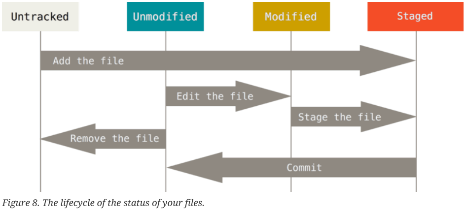

# 带你入门

> 撰稿人：邹强 
> 基本简介：本文档主要讲解了Git的基本用法, 方便入门及日后查询 
> 作成时间：2018-8-1 
> 修改时间：2018-8-20

* ### 初次使用Git
> 1. 下载 
> [下载地址](https://git-scm.com/downloads)
> 2. 安装 
> 一路选择默认下一步安装即可
> 3. 启动 
> 在需要使用Git的目录下，点击右键选择`Git Bash Here`

* ### Linux 最基本命令
> 1. 进入指定全路径 
> `cd /c/user/my_project`
> 2. 进入某一下级路径(当前路径下存在的文件夹) 
> `cd test`
> 3. 进入上一级路径 
> `cd ..`
> 4. 查看当前所在路径 
> `pwd`

* 练习题：使用Git切换路径

* ### 文件在Git中的生存周期

* ### 本文内容状态定义及解释

1. 名词解释
    * 工作区：工作目录内容，用户做的所有改动默认处于工作区
    * 暂存区：提交仓库前的临时区域,`git add a.txt` 可以将文件(a.txt)提交到暂存区
    * 仓库区：最终本地仓库区域
    * 分支：代码的平行世界管理利器
        > 假设项目开发过程中，需要临时并行开发一个feature, 我们就可以使用分支功能，专门为该feature开辟一个分支，该feature的开发都在新分支上，这样中途开发的半成品，不会影响主线的开发，在该feature完成的时候，可以将分支合并到主线。
    * 拉取(pull): 从远程仓库获取最新数据，并且与本地自动合并
    * 获取(fetch):从远程仓库获取最新数据，但并不与本地全并
    * 变基(rebase):
1. 内容状态定义
    * unstaged：未进入暂存区（处于工作区）的内容
        * untracked : 新增文件
        * modified ：被修改的内容
    * staged：已经进入暂存区的改动
    * commited：已经进入仓库的内容

* ### 初始化操作命令

1. 本地创建仓库
    > `git init`
2. 从服务器上Clone一个仓库
    > `git clone ssh://user@domain.com/repo.git`
3. 设置全局用户名
    > `git config --global user.name "zouqiang"`
4. 设置全局邮箱
    > `git config --global user.email "qiang.zou@chiquan-jx.com"`
5. 创建SSH公私匙对
    > `ssh-keygen -t rsa -C "qiang.zou@chiquan-jx.com"`
6. 设置远程仓库简称为`origin`
    > `git remote add origin git@github.com:pettypower/SJY.git`

* ### 日常工作基本命令

1. 查看最新状态
    > `git status`

2. 提交到暂存区：将改动从 unstaged --> staged 
    > `git add nFile.txt` 

3. 提交到仓库区
    > * `git commit -m "some comment"` 此操作会将暂存区的改动提交
    > * `git commit -a -m "some comment2" `此操作会将工作区，暂存区的改动一并提交

4. 推送到远程仓库
    > `git push -u origin master` 推送到远程仓库`origin`（初始化时曾设置好的地址）的`master`分支

* ### 日常工作常用命令

1. 撤回工作区内容：放弃工作区修改
    > `git checkout -- nFile.txt`
    >  两种可能性
    >  1. 暂存区有此文件，工作区恢复成暂存区版本 
    >  2. 暂存区无此文件，工作区恢复成仓库版本

2. 撤回暂存区内容: 将改动从 staged --> unstaged
    > * `git reset HEAD nFile.txt`

3. 撤回仓库区内容：（实际调整的是仓库区的HEAD）
    > * `git reset --hard HEAD^` 将仓库退回到上一个版本（HEAD^^则表示退回到上两个版本，并同步到本地工作区，HEAD~5表示退回到上5个版本）
    > * `git reflog` 命令历史
    > * `git reset --hard 版本号` 将仓库的HEAD指向某版本（可前进，可后退）

4. 删除&移动文件
    > * `git rm nFile.txt` 删除`nFile.txt`并提交到暂存区
    > * `git rm --cached nFile.txt` 删除暂存区但保留工作区的`nFile.txt`文件
    > * `git rm log/\*.log` 删除log目录下所有后缀为log的文件
    > * `git rm \*~` 删除所有以~结尾的文件
    > * `git mv nFile.txt nFile2.txt` 将`nFile.txt` 重命名为`nFile2.txt`文件

5. 查看区别
    > * `git diff ` 累积在unstaged(工作区)状态的改动
    > * `git diff --staged ` 累积在staged状态的改动
    > * `git diff HEAD -- nFile.txt` 查看工作区与版本库最新版本区别（nFile.txt文件）

9. 查看日志
    > * `git log` 显示所有提交记录（后面追加-3 参数表示显示最新3条记录）
    > * `git log -p` 显示所有提交记录，并显示每次提交的对比
    > * `git log --stat` 显示所有提交记录，并显示每闪提交`简略`对比
    > * `git log --pretty=oneline` 显示所有提交记录，可以自定义格式`oneline, format="%h - %an"`,如果不指定格式，则与`git log`显示效果一致

10. 改写提交
    > * `git commit --amend`

* ### 小技巧
1. Git 中文显示不出来问题解决
    > `git config --global core.quotepath false` 
    >  #不对0x80以上的字符进行quote，解决git status/commit时中文文件名乱码

* ### 实验练习

1. 证明Git默认提交是以修改内容为单位，而不是以文件为单位
    > 1. 新增非空文件 newFile.txt
    > 2. 跟踪该文件 `git add newFile.txt`
    > 3. 修改该文件 
    > 4. 提交暂存区 `git commit -m "add new File"`
    > * 结果：提交后，用Git status查看，可看到newFile.txt仍有改动处于Modified状态
    > * 结论：Git默认提交的是暂存区内容，和文件内容无关（加上 -a 参数，可以将工作区的修改也一并提交，这样看上去就是以文件为单位提交了）

2. 证明Git可以强制以文件为单位提交
    > 1. 新增非空文件 nFile2.txt
    > 2. 跟踪该文件 `git add nFile2.txt`
    > 3. 修改该文件
    > 4. 提交该文件 `git commit nFile2.txt -m "add f"`
    > * 结果： 提交后，用Git status查看，可看到nFile2.txt已经完全提交到仓库
    > * 结论： Commmit命令是可以指定文件的，指定后，该文件的暂存区+工作区都将被提交

3. 解决一个冲突
    > 1. 从远程仓库clone一个新的本地仓库B
    > 2. 

* ### 原汗原味的解释
> start a working area (see also: git help tutorial)
   1. `clone`      Clone a repository into a new directory
   2. `init`       Create an empty Git repository or reinitialize an existing one

> work on the current change (see also: git help everyday)
   1. `add`        Add file contents to the index
   2. `mv`         Move or rename a file, a directory, or a symlink
   3. `reset`      Reset current HEAD to the specified state
   4. `rm`         Remove files from the working tree and from the index

> examine the history and state (see also: git help revisions)
   1. `bisect`     Use binary search to find the commit that introduced a bug
   2. `grep`       Print lines matching a pattern         
   3. `log`        Show commit logs
   4. `show`       Show various types of objects
   5. `status`     Show the working tree status

> grow, mark and tweak your common history
   1. `branch`     List, create, or delete branches
   2. `checkout`   Switch branches or restore working tree files
   3. `commit`     Record changes to the repository
   4. `diff`       Show changes between commits, commit and working tree, etc
   5. `merge`      Join two or more development histories together
   5. `rebase`     Reapply commits on top of another base tip
   5. `tag`        Create, list, delete or verify a tag object signed with GPG

> collaborate (see also: git help workflows)
   1. `fetch`      Download objects and refs from another repository
   2. `pull`       Fetch from and integrate with another repository or a local branch
   3. `push`       Update remote refs along with associated objects

